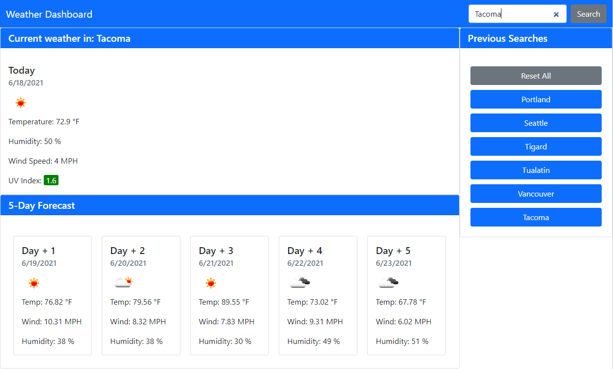

# Weather Dashboard

## Description
This application allows a user to search for current and future weather for a city. Upon searching a city, both current weather data and a 5-day forecast are displayed. The searched city is added to a search history that the user can re-visit later. This application uses the Open Weather Map API. Design is responsive for all screen sizes.

[Deployed Application](https://spreston4.github.io/weather-dashboard/)

[GitHub Repo](https://github.com/spreston4/weather-dashboard)

## Technologies used
Built in Visual Studio with:
* Open Weather Map API
* Javascript / jQuery
* CSS / Bootstrap
* HTML

## How to
When the application is loaded, enter a city in the search bar. Pressing the 'Search' button will display current and future weather data to the page. The searched city is added to the 'Previous Searches' section. The user can press the button of a previously searched city to review data for that city. To clear previous searches & reset current weather data, press the 'Reset All' button.



## User Story
Given the following user story:

```
AS A traveler
I WANT to see the weather outlook for multiple cities
SO THAT I can plan a trip accordingly
```

## Acceptance Criteria
Given the following acceptance criteria:

```
GIVEN a weather dashboard with form inputs
WHEN I search for a city
THEN I am presented with current and future conditions for that city and that city is added to the search history
WHEN I view current weather conditions for that city
THEN I am presented with the city name, the date, an icon representation of weather conditions, the temperature, the humidity, the wind speed, and the UV index
WHEN I view the UV index
THEN I am presented with a color that indicates whether the conditions are favorable, moderate, or severe
WHEN I view future weather conditions for that city
THEN I am presented with a 5-day forecast that displays the date, an icon representation of weather conditions, the temperature, the wind speed, and the humidity
WHEN I click on a city in the search history
THEN I am again presented with current and future conditions for that city
```

## Contact Me
GitHub: [spreston4](https://github.com/spreston4)

E-mail: [sam.preston11@gmail.com](mailto:sam.preston11@gmail.com)